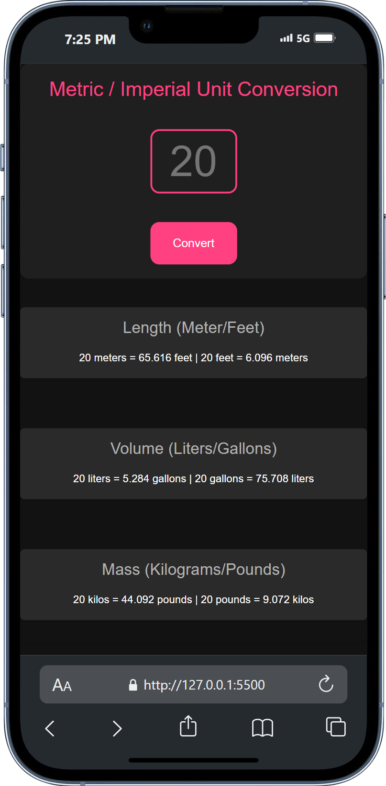
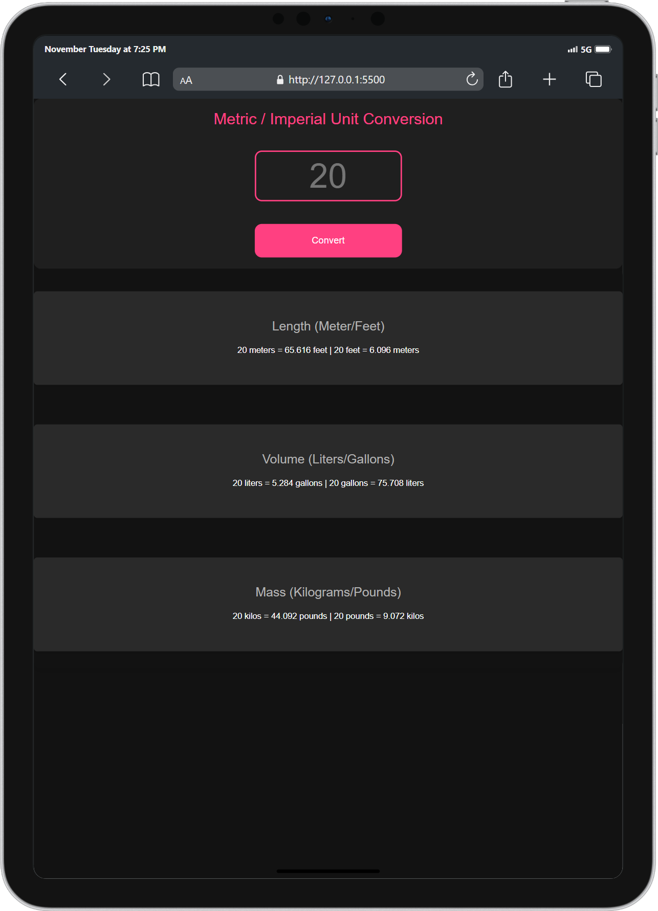

# **Unit Sync**

## **Table of Contents**
- [Project Overview](#project-overview)
- [Features](#features)
- [Installation](#installation)
- [Usage](#usage)
- [Technologies Used](#technologies-used)
- [Screenshots](#screenshots)
- [License](#license)

## **Project Overview**
Unit Sync is a web application that allows users to convert various units of measurement between metric and imperial systems. Built using HTML, CSS, and JavaScript, the project provides a simple and intuitive interface for performing unit conversions.

## **Features**
- Responsive design optimized for mobile and desktop devices.
- Conversion of meters to feet, liters to gallons, and kilograms to pounds.
- Real-time input validation and conversion results.
- Modular JavaScript functions for easy customization and scaling.
- Modern and vibrant dark theme for an engaging user experience.

## **Installation**

- Clone the repository.
- Navigate to the project directory: `cd Unit-Sync`
- Open `index.html` in your preferred web browser.

## **Usage**
Once the project is open in your browser, you can use the input field to enter a value and click the "Convert" button to see the conversion results.

- Customize the conversion logic by editing the `index.js` file.
- Update styles and themes by editing the `styles.css` file.

## **Technologies Used**

-  - Used for structuring the web page.
-  - Used for styling components.
-  - Used for interactivity and logic implementation.

## **Screenshots**

|  |  | .png) |
|:---------------------------------------------------:|:-----------------------------------------------:|:----------------------------------------------------------:|
| Unit Sync on iPhone                                 | Unit Sync on iPad                               | Fullscreen View on Desktop                                 |

## **License**
This project is licensed under the MIT License - see the [LICENSE](LICENSE) file for details.

<!-- IVIonsters Designs -->